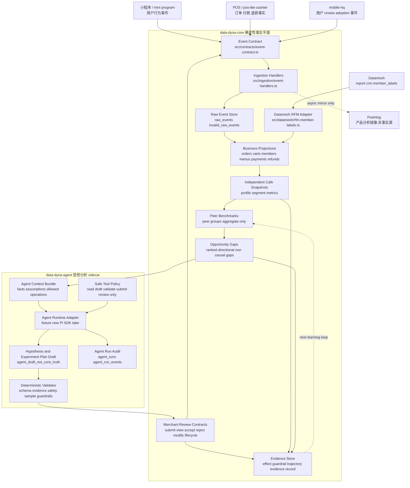
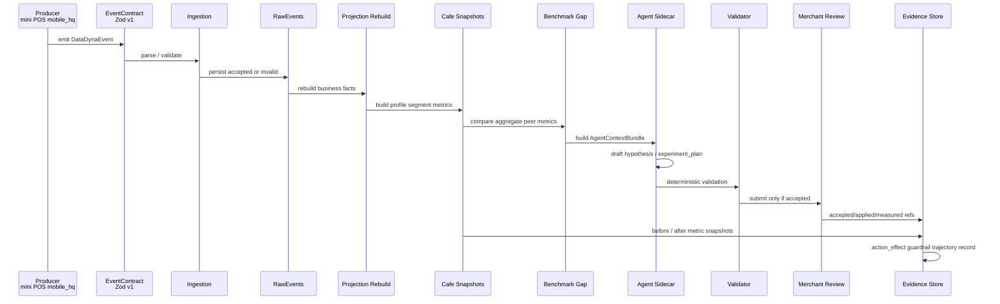
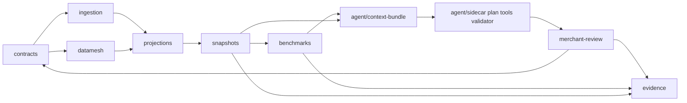

# data-dyna 当前整体架构与 Vibe Coding 适配性评审

状态：current implementation architecture review v1  
日期：2026-05-03  
范围：基于当前 `src/`、`migrations/`、`tests/`、`.pi/` 与 `docs/plan/*` 的已实现 MVP，不描述尚未落地的生产系统。  
读者：后续维护者、AI coder、架构评审者、准备新计划的执行者。

## 0. 结论摘要

`data-dyna` 当前已经实现了一个清晰的本地 MVP 架构：

```text
Data Core owns facts.
Pi Agent owns hypotheses.
Validator owns safety.
Merchant owns decisions.
Evidence Store owns proof.
```

中文解释：

```text
Data Core 负责可信事实；
Pi Agent 只生成经营假设和实验草稿；
Validator 用确定性规则做安全校验；
商户确认后才进入行动生命周期；
Evidence Store 记录实验前后效果和证据。
```

当前业务闭环已在代码和测试中打通：

```text
事件合同
  -> 事件接收与 raw event 存储
  -> 业务投影与 Datamesh RFM 快照
  -> 独立咖啡店画像和指标
  -> 同类门店 benchmark 与 opportunity gap
  -> Agent context bundle
  -> Agent 实验草稿
  -> deterministic validator
  -> merchant review / adoption lifecycle
  -> effect / guardrail / evidence record
```

当前架构对 AI coder / vibe coding 的适配性整体较高，原因是：

- 模块边界基本单向；
- 事实层和 Agent 层没有混成一个大模型黑盒；
- 关键对象由 Zod schema 和 TypeScript type 双重表达；
- 每个业务 slice 都有对应测试；
- Agent 不能直接写事实表或执行业务变更；
- 文档、计划包、测试和代码路径基本能互相追踪。

主要不足也明确：

- 当前已从本地函数和 SQL schema MVP 前进到最小 Fastify + PostgreSQL raw-event runtime foundation，但仍不是完整生产服务；
- 已有 `/events` API、local/CI PostgreSQL migration gate、raw-event PostgreSQL repository、boundary/schema/plan checks 和 contract-only worker seams；仍缺 durable queue workers、production deployment/auth/observability、真实 Agent runtime 和外部 producer instrumentation；
- 模块边界已有轻量 `check:boundaries` 自动化，但仍不是完整 lint / CODEOWNERS / policy-as-code 治理；
- `.pi` skill / prompt 已存在，但还没有真实 Pi SDK runtime/provider 集成；
- 外部 repo 接入、真实 Datamesh、真实 POS/小程序/mobile-hq instrumentation 尚未开始。

综合评价：

| 维度 | 评分 | 结论 |
|---|---:|---|
| 业务闭环清晰度 | 9/10 | 从事实到证据的闭环已经明确。 |
| 模块化程度 | 9/10 | 模块边界清楚，并已有 `check:boundaries`、module README 和 plan gate；完整 CODEOWNERS/lint 仍可后续增强。 |
| 可测试性 | 9/10 | 本地 deterministic 测试完整，并已有 local PostgreSQL migration/repository/runtime gates；生产 e2e 仍未覆盖。 |
| Vibe coding 适配性 | 8/10 | 非常适合 AI 按模块扩展；高风险状态机仍需人审和 guardrail。 |
| 生产就绪度 | 5/10 | 已有最小 runtime foundation；生产部署、可观测、权限和真实集成尚未完成。 |

---

## 1. 当前实现清单

### 1.1 源码模块

| 模块 | 当前路径 | 主要职责 |
|---|---|---|
| Event Contract | `src/contracts/event-contract.ts` | 定义统一事件版本、来源、领域、事件名、身份、关联、实体、属性、幂等键。 |
| Ingestion | `src/ingestion/event-handlers.ts` | 处理单事件和批量事件；Zod 校验；重复幂等处理；无权威 PostHog 异步 sink。 |
| Raw Event Store | `src/ingestion/raw-event-store.ts` | 本地内存 raw event / invalid event store 接口与实现。 |
| PostHog Sink Boundary | `src/ingestion/posthog-sink.ts` | 产品分析镜像边界；不是事实源。 |
| App Adapter Foundation | `src/app/**` | Fastify `/healthz`、`/events`、`/events/batch`；local/test runtime config；PostgreSQL raw-event repository；contract-only worker seams；不拥有 production deployment/auth/observability/Agent runtime。 |
| Datamesh RFM Adapter | `src/datamesh/rfm-member-labels.ts` | 将 `report.crm.member_labels` 行转为 `member_rfm_snapshots` 输入；不重算 RFM。 |
| Business Projections | `src/projections/business-projections.ts` | 从 raw events + RFM rows 重建 sessions、carts、orders、payments、refunds、menus、members、merchant actions 等投影。 |
| Independent Cafe Snapshots | `src/snapshots/independent-cafe-snapshots.ts` | 生成独立咖啡店 profile、segment candidate、metric definitions、metric snapshots。 |
| Peer Benchmarks / Gaps | `src/benchmarks/opportunity-gaps.ts` | 聚合同类门店指标，生成 peer group、peer benchmark、opportunity gap。 |
| Agent Context Bundle | `src/agent/context-bundle.ts` | 把 deterministic opportunity gap 封装成 Agent 可读上下文，同时声明允许/禁止操作。 |
| Agent Sidecar | `src/agent/agent-sidecar.ts` | 记录 agent run / event，调用 adapter 捕获 draft，保证 draft 不变成 Core truth。 |
| Agent Tools Policy | `src/agent/agent-tools.ts` | 定义安全高层工具 allowlist，拒绝直接 mutation 工具。 |
| Experiment Plan | `src/agent/experiment-plan.ts` | 定义 hypothesis / experiment plan schema 和 fixture draft 生成。 |
| Experiment Validator | `src/agent/experiment-validator.ts` | 确定性检查 identity、truth boundary、evidence refs、uncertainty、merchant confirmation、rollback、guardrail、sample status。 |
| Merchant Review | `src/merchant-review/experiment-review.ts` | 商户 review、view、accept/reject/modify、lifecycle、preference candidate / confirmation、mobile-hq event builder。 |
| Evidence Store | `src/evidence/evidence-store.ts` | before/after effect、guardrail result、trajectory、evidence record，禁止 LLM claim 入证据事实。 |

### 1.2 数据库 migration

| Migration | 表/主题 | 业务意义 |
|---|---|---|
| `migrations/0001_raw_events.sql` | `raw_events`, `invalid_raw_events` | 原始事件和非法事件审计。 |
| `migrations/0002_business_projections.sql` | sessions/carts/orders/payments/refunds/menus/items/members/RFM/merchant_actions | 业务事实投影。 |
| `migrations/0003_independent_cafe_snapshots.sql` | store profile、metric snapshots、restaurant segments、merchant confirmations | 独立咖啡店画像与指标快照。 |
| `migrations/0004_peer_benchmarks.sql` | peer groups、peer benchmarks、opportunity gaps | 同类对比和机会缺口。 |
| `migrations/0005_agent_runs.sql` | agent runs、agent run events | Agent 调用审计，防止 draft 晋升为事实。 |
| `migrations/0006_merchant_review.sql` | review、decision、action lifecycle、preference candidate/confirmation | 商户确认和行动生命周期。 |
| `migrations/0007_evidence_store.sql` | action effects、guardrail results、trajectories、evidence records | 实验效果和证据存储。 |

### 1.3 测试覆盖

`package.json` 当前 test 串联以下测试：

- `tests/event-contract.spec.ts`
- `tests/ingestion-handlers.spec.ts`
- `tests/projections-dd-p1-s1.spec.ts`
- `tests/snapshots-dd-p1-s2.spec.ts`
- `tests/benchmarks-dd-p2-s1.spec.ts`
- `tests/agent-dd-p3-s1.spec.ts`
- `tests/agent-dd-p3-s2.spec.ts`
- `tests/merchant-review-dd-p4-s1.spec.ts`
- `tests/evidence-dd-p5-s1.spec.ts`
- `tests/app-runtime-s2.spec.ts`
- `tests/app-workers-s5.spec.ts`

另有 local PostgreSQL-backed gates：

- `npm run test:db:migrations` validates migration execution and required PostgreSQL constraints.
- `npm run test:app:repository` validates `PostgresRawEventRepository` accepted/duplicate/invalid persistence.
- `npm run test:runtime` validates the Fastify `/events` + `/events/batch` route path against migrated local PostgreSQL.

这些测试证明：当前闭环主要靠纯函数、Zod schema、fixture、内存 store 和 local PostgreSQL integration gates 验证，不依赖生产服务和秘密凭证。

---

## 2. 总体架构图



---

## 3. 核心数据流



业务含义：

- Producer 只负责提供事件或外部事实。
- Data Core 只用确定性代码生成事实、指标、gap、evidence。
- Agent 只在 gap 之后进入，用于解释和生成方案草稿。
- Validator 是 Agent 输出进入商户 review 的唯一闸门。
- Merchant review 是业务动作进入生命周期的唯一入口。
- Evidence Store 只沉淀可复现证据，不接受 LLM claim 作为事实。

---

## 4. 模块依赖关系

当前源码依赖总体是单向的：从基础 contract / facts 到 projection / metrics / benchmark，再到 agent draft / review / evidence。



注意：`merchant-review` 需要构造 `mobile_hq.*` 事件，所以它有一条回到 `contracts` 的合法依赖。这不是事实层反向依赖 Agent，而是输出事件合同复用。

### 4.1 边界矩阵

| 平面 | Owner | 可以拥有 | 可以调用 | 禁止拥有/调用 |
|---|---|---|---|---|
| Event Contract | Core | 事件版本、来源、事件名、身份、幂等、实体、属性 schema | 无业务上游 | 不拥有指标、不拥有 Agent 草稿、不拥有商户决策。 |
| Ingestion | Core | 校验、raw persistence、invalid audit、idempotency、PostHog async mirror | Event Contract、RawEventStore、PostHog sink interface | 不计算业务指标，不把 PostHog 当事实源，不吞掉非法事件。 |
| Projections | Core | sessions/carts/orders/payments/refunds/items/menus/members/RFM 投影 | Raw events、Datamesh RFM adapter | 不重算 RFM，不把前端 checkout 当最终支付事实，不调用 Agent。 |
| Snapshots | Core | 独立咖啡店 profile、segment candidate、四个 MVP metrics | BusinessProjections | 不做 LLM 分类，不扩成全餐饮 BI。 |
| Benchmarks | Core | aggregate-only peer group、benchmark、opportunity gap | Metric snapshots、segments | 不暴露 peer store/customer identity，不声称因果。 |
| Agent Context | Bridge | facts/assumptions/allowed operations/disallowed targets | OpportunityGap | 不新增事实，不隐藏 evidenceRefs。 |
| Agent Sidecar | Agent | run audit、adapter draft、draft truth boundary | ContextBundle、safe tools | 不写 facts，不执行菜单/价格/券/消息变更。 |
| Validator | Safety | deterministic accept/block/needs_more_data | Context、hypothesis、plan schema | 不把判断交给 LLM，不绕过证据/样本/guardrail。 |
| Merchant Review | Merchant / Integration | submission/view/accept/reject/modify/apply/revert/preference confirmation contract | Accepted validated plan | 不直接调用真实业务 mutation，不把拒绝文本永久化为偏好。 |
| Evidence Store | Core Evidence | effect、guardrail、trajectory、evidence record | ExperimentPlan、review/adoption refs、metric snapshots、opportunity gap | 不接受 LLM claim，不过度因果化。 |

---

## 5. 业务组件关系说明

### 5.1 Event Contract 是全系统入口合同

`src/contracts/event-contract.ts` 定义：

- `version = event-contract.v1`
- source：`mini_program` / `pos` / `mobile_hq` / `datamesh` / `system`
- domain：`user_behavior` / `transaction_scene` / `merchant_action` / `external_fact_snapshot` / `system_fact`
- event names：小程序行为、POS 订单支付退款、mobile-hq review/adoption、Datamesh RFM import、system projection rebuild
- producer、identity、correlation、entity、properties、idempotency

架构意义：

- 所有外部系统先对齐事件合同，避免每个 producer 自己发明字段。
- AI 不直接读取混乱输入，而是读取 Core 已验证的结构化上下文。
- idempotency 是后续生产接入和重放的基础。

### 5.2 Ingestion 是事实入口，不是指标计算层

`handlePostEvent` 和 `handlePostEventsBatch` 只做：

- schema validation；
- accepted / invalid persistence；
- duplicate detection；
- optional PostHog async enqueue。

它刻意不做：

- 指标计算；
- projection rebuild；
- 商业动作执行；
- Agent 调用。

这是好的分层：ingestion 只保证入口可审计，业务事实由后续 projection 生成。

### 5.3 Projections 把事件变成业务事实

`rebuildBusinessProjections` 当前从 raw events 生成：

- sessions；
- carts；
- orders/order_items；
- payments/refunds；
- menus/items；
- members/member_profiles；
- member_rfm_snapshots；
- merchant_actions。

重要边界：

- POS 是订单、支付、退款最终事实源：`finalFactSource: "pos"`。
- 小程序 checkout 只作为 attribution helper，不被当成最终支付事实。
- Datamesh RFM 使用 `report.crm.member_labels` 快照，不在 MVP 内重算 RFM。

### 5.4 Snapshots 聚焦独立咖啡店，不做泛 BI

`rebuildIndependentCafeSnapshots` 当前产生：

- `StoreProfileSnapshot`
- `RestaurantSegmentCandidate`
- `MetricDefinition`
- `MetricSnapshot`
- `MerchantConfirmation`

MVP 指标只有四个：

| Metric | 业务含义 | source | guardrail relation |
|---|---|---|---|
| `repurchase_90d_rate` | 90 天复购率 | `member_rfm_snapshots` | growth metric |
| `avg_order_value` | 平均客单价 | `orders` | growth metric |
| `refund_rate` | 退款率 | `refunds` + `orders` | negative guardrail |
| `checkout_started_cart_rate` | 购物车进入 checkout 比例 | `carts` | funnel metric |

架构评价：这个集合足够小，适合 MVP 和 AI coder 维护；没有被膨胀成“所有餐饮 BI 指标”。

### 5.5 Benchmarks 把指标变成机会缺口

`rebuildPeerBenchmarkOpportunityGaps` 负责：

- 找出同 segment 的 peer stores；
- 计算 aggregate-only median / p75；
- 根据 `minPeerStoreCount >= 3` 标记 sample status；
- 生成 ranked opportunity gaps；
- evidenceRefs 只指向 aggregate refs 和目标店自身 refs。

关键安全点：

- peer benchmark 是 directional non-causal；
- insufficient / weak sample 不应被当成可 launch 的强建议；
- 不输出 peer store/customer identity。

### 5.6 Agent 只在 opportunity gap 后进入

Agent 输入不是原始日志，也不是任意数据库查询，而是 `AgentContextBundle`：

- 固定 contract version；
- 与 opportunity gap identity 对齐；
- facts 只包含 deterministic opportunity gap；
- assumptions 明确；
- allowed operations 明确；
- disallowed mutation targets 明确；
- evidenceRefs 必须和 opportunity gap evidenceRefs 一致。

这让 AI coder 或 LLM 不能轻易把“编故事”混入事实层。

### 5.7 Validator 是 Agent 输出闸门

`validateExperimentPlan` 的判定只有：

- `accept`
- `block`
- `needs_more_data`

它检查：

- schema 是否有效；
- context/hypothesis/plan identity 是否一致；
- Agent draft 是否仍是 `agent_draft_not_core_truth`；
- 是否请求 core writes；
- evidence refs 是否来自 context；
- uncertainty/confidence 是否存在；
- 是否需要商户确认；
- 是否支持 rollback；
- 是否有 guardrail；
- peer sample 是否 sufficient。

这使得 Agent 不可能仅凭自然语言绕过安全边界。

### 5.8 Merchant Review 是人类决策边界

`src/merchant-review/experiment-review.ts` 将业务动作拆成：

```text
submitted_for_review
viewed
accepted / rejected / modified
applied_recorded
reverted_recorded
measured
kept / reverted / extended / retest_needed
preference_candidate
preference_confirmed
```

重要规则：

- 只有 validator accepted 的 plan 才能 submit review；
- apply 必须有 explicit merchant acceptance decision；
- apply/revert 必须有 rollbackRef；
- `businessMutationCalled` 永远为 false；
- rejection text 只能生成 candidate，不能直接变永久 preference。

### 5.9 Evidence Store 闭合经营实验回路

`src/evidence/evidence-store.ts` 生成：

- `ActionEffect`
- `GuardrailResult`
- `InterventionTrajectory`
- `EvidenceRecord`

它回答：

```text
这个商户确认过的实验，执行后主指标是否改善？
guardrail 是否恶化？
样本是否足够？
整体 verdict 是 clean_success、mixed_guardrail_degraded、no_clear_lift 还是 needs_more_data？
这个 evidence record 是否可以从存储事实重新复现？
```

关键边界：

- `llmGeneratedClaims` 必须为空；
- weak sample / missing data 会降级为 low / needs_more_data；
- 主指标改善但 guardrail degradation 不能算 clean success；
- interpretation 是 directional before/after non-causal，不做因果过度声称。

---

## 6. 架构模块化深度评价

### 6.1 优点

#### 6.1.1 主干流向清楚

当前主干是线性且可追踪的：

```text
contract -> ingestion -> raw event -> projection -> snapshot -> benchmark/gap -> agent context -> draft -> validator -> review -> evidence
```

这对 AI coder 很友好：修改某个阶段时，很容易定位输入、输出、测试和下游影响。

#### 6.1.2 事实层和生成层分离明确

最大优点是没有让 Agent 变成“万能业务层”。当前代码多处强制表达：

- Agent draft truth status：`agent_draft_not_core_truth`
- Agent requested core writes：空数组；
- context disallowed mutation targets：orders / metrics / benchmarks / evidence_facts / business_configs / menu / price / coupon / customer_message_execution；
- tool mutation policy：`no_core_or_business_mutation`
- evidence record：`llmGeneratedClaims = []`

这使得系统对“AI 生成内容污染事实表”的风险有明确防线。

#### 6.1.3 Zod schema 是强 SSOT

每个关键业务对象基本都有 Zod schema：

- event contract；
- Datamesh RFM row；
- Agent context bundle；
- Agent run / draft；
- experiment hypothesis / plan；
- validation result；
- merchant review contracts；
- evidence records。

Zod 同时服务：

- runtime validation；
- TypeScript type inference；
- 测试断言；
- AI coder 读代码时的结构化说明。

#### 6.1.4 函数式 rebuild 适合测试和重放

当前 projection、snapshot、benchmark、evidence 大多是纯函数式 rebuild / assemble：

- 输入 fixture；
- 输出 deterministic object；
- 无隐藏数据库状态；
- 易于 snapshot / unit 测试；
- 易于后续替换为 worker。

这比一开始写复杂服务编排更适合 MVP。

#### 6.1.5 每个 slice 有独立测试入口

测试文件按计划 slice 命名，便于定位：

```text
DD-P0-S1 -> tests/event-contract.spec.ts
DD-P0-S2 -> tests/ingestion-handlers.spec.ts
DD-P1-S1 -> tests/projections-dd-p1-s1.spec.ts
...
DD-P5-S1 -> tests/evidence-dd-p5-s1.spec.ts
```

这对 autopilot / AI coder 极其友好：读计划即可找到对应测试。

### 6.2 当前不足

#### 6.2.1 边界已有轻量 import rule，但不是完整治理

当前模块依赖关系清楚，并已有 `scripts/check-boundaries.mjs` 自动检查 Core / Agent / Evidence 关键 import 方向。仍未实现：

- ESLint boundary rule；
- dependency-cruiser；
- CODEOWNERS；
- CI import matrix beyond current command wiring。

风险：后续 AI coder 仍可能在尚未覆盖的新目录或新 runtime surface 中引入不当依赖；因此修改 `src/*` import 后仍必须运行 `npm run check:boundaries` 并人工确认 owner 边界。

#### 6.2.2 runtime foundation 已有最小 app/API/DB/worker seam，但不是生产运行层

当前不再只是本地 pure-function MVP；已新增最小 runtime foundation：

- Fastify app/config/server skeleton；
- `/events` and `/events/batch` HTTP routes；
- local/test-only `PostgresRawEventRepository` for raw events；
- local/CI migration execution gate；
- contract-only projection/snapshot/benchmark/evidence worker seams。

仍未完成的生产运行层包括：

- production deployment, secrets, rollout/rollback, and auth/tenancy；
- durable queue workers, retry/checkpoint/dead-letter semantics, and production scheduler；
- production observability / incident-response ownership；
- projection/snapshot/benchmark/evidence repositories beyond raw events；
- external producer instrumentation and real traffic ingress hardening。

这不是设计错误；它是 intentionally minimal foundation，不应被误认为 production ready。

#### 6.2.3 Agent runtime 还是 adapter / fixture 边界

已有 Agent sidecar 结构和 audit schema，但：

- 尚未接入真实 Pi SDK；
- 尚未配置 provider/model；
- `.pi` prompt/skill 还没有被 runtime 注册验证；
- event streaming / compaction / session branch 还停留在架构意图和 fixture 证明。

后续接入时必须保持现有 truth boundary，不要让 Pi tool 直接拥有业务 mutation。

#### 6.2.4 状态机复杂度开始上升

`merchant-review` 和 `evidence-store` 已经包含状态转换、apply/revert、measurement、guardrail、verdict 等逻辑。它们是高价值但高风险模块。

风险点：

- lifecycle transition 未来容易被扩展坏；
- rollbackRef 语义需要生产合同；
- effect measurement window 未来会变复杂；
- evidence verdict 很容易被产品需求推动成“营销成功故事”，削弱 non-causal 边界。

这些模块适合 AI 生成测试和 schema wiring，但关键业务规则变更应有人审。

#### 6.2.5 文档已有多份，需要明确当前入口

当前已有 `docs/stack/data-dyna-core-and-pi-agent-sidecar-architecture.md` 等 roadmap / analyse / plan 文档。新读者可能不知道先读哪个。

建议：

- 当前实现架构入口使用本文；
- 长期目标/选型背景读 `docs/stack/data-dyna-core-and-pi-agent-sidecar-architecture.md`；
- 当前执行状态读 `docs/plan/README.md` 和 `docs/plan/data-dyna-autopilot_STATUS.md`。

---

## 7. Vibe Coding 适配性评价

本文将 vibe coding 定义为：

```text
让 AI coder 能在明确边界、明确合同、明确测试、明确禁止事项下快速修改代码；
同时避免 AI 因上下文不全而破坏事实归属、状态机、幂等、权限和证据边界。
```

### 7.1 AI-safe 工作面

这些工作面适合 AI coder 高效处理：

| 工作面 | AI 适配性 | 原因 | 最小验证 |
|---|---:|---|---|
| 新 event name / schema 扩展 | 高 | Zod enum/schema 明确，测试可直接覆盖。 | event contract tests + typecheck |
| 新 projection 字段 | 中高 | 输入 raw event 和输出 projection 明确。 | projection fixture tests |
| 新 metric definition | 中高 | metric numerator/denominator/window/source/guardrail 已有模式。 | snapshot tests + benchmark tests |
| 新 benchmark 聚合字段 | 中 | 需注意隐私阈值和 aggregate-only。 | benchmark tests + no peer identity assertion |
| 新 Agent tool descriptor | 中高 | allowlist + mutation policy 明确。 | agent tool policy tests |
| 新 prompt / skill 文案 | 高 | 不直接影响事实层。 | text probe + validator tests |
| 新 experiment plan schema 字段 | 中 | 需同步 validator / review / tests。 | agent-dd-p3-s2 + merchant review tests |
| 文档、contract mapping、runbook | 高 | 边界清楚，风险较低。 | git diff --check |

### 7.2 Human-critical 工作面

这些工作面不适合 AI 单独决定，需要人类 review 或新计划：

| 工作面 | 风险 | 必须关注 |
|---|---|---|
| 商户 action lifecycle 状态机 | 错误转换可能导致未确认即执行。 | accepted -> applied、rollbackRef、businessMutationCalled=false。 |
| Evidence verdict 规则 | 容易过度声称经营成功或因果。 | weak sample、guardrail degradation、non-causal interpretation。 |
| 幂等和重放语义 | 生产重复事件会污染事实。 | idempotency scope、event ordering、rebuild consistency。 |
| POS / payment / refund 权威边界 | 错把前端事件当最终交易事实会造成业务错误。 | POS finalFactSource。 |
| Datamesh RFM 语义 | 重算或误读 RFM 会破坏指标口径。 | `report.crm.member_labels` snapshot source。 |
| Peer privacy threshold | 可能泄露其他商户或客户。 | aggregate-only、min peer count、no peer IDs。 |
| Agent tool execution | 一旦能改菜单/价格/券/消息，风险极高。 | safe allowlist、no mutation policy、validator、merchant confirmation。 |
| 真实生产 API / worker / DB repo | 涉及事务、并发、重试、权限、回滚。 | 需单独设计和集成测试。 |

### 7.3 当前对 AI coder 的友好点

1. **文件名与 slice 对齐**：测试名包含 `dd-p*`，容易按计划定位。
2. **Schema 即文档**：Zod schema 让 AI 不必猜字段。
3. **纯函数多**：AI 修改局部函数后能快速跑测试。
4. **禁止事项写进类型和 schema**：不是只靠 README 记忆。
5. **Agent 权限很小**：AI 相关代码本身也被策略约束。
6. **计划控制面明确**：`docs/plan/README.md` 指向当前 active pack，历史 pack 以 `PACK_COMPLETE` 保持终态，不容易误续旧任务。

### 7.4 当前对 AI coder 的主要风险

1. **边界检查仍是轻量脚本**：已有 `check:boundaries`，但不是完整 lint / CODEOWNERS / dependency-cruiser 治理。
2. **runtime foundation 容易被过度解读**：已有 `/events`、raw-event PostgreSQL repo 和 worker seams，但 production deployment/auth/observability/queue reliability 仍未完成。
3. **worker 仍是 contract-only**：projection/snapshot/benchmark/evidence workers 只是 ownership descriptors，不是可执行 production workers。
4. **测试串联在一个 npm script**：小项目可接受，变大后定位失败会变慢；runtime/DB gates 需按修改面额外运行。
5. **SQL migration 与 Zod schema 只有 smoke + DB gate 覆盖**：已有 `check:schema-migrations` 和 `test:db:migrations`，但未来字段漂移仍需要更强 contract tests。
6. **`.pi` runtime 尚未实装**：skill/prompt 和真实 agent execution 的契约未被端到端验证。

---

## 8. Vibe Coding 适配性改进建议

这些建议已由 `data-dyna-vibecoding-guardrails` 与 `data-dyna-production-runtime-foundation` 计划包部分转化为本地 guardrails 和 minimal runtime foundation；未实现 production deployment/auth/observability、durable worker reliability、真实 Agent runtime 或外部 producer 集成的部分仍明确标为 residual / future plan。

### 8.1 增加架构边界检查

建议新增一个轻量脚本，例如 `scripts/check-boundaries.mjs`，约束：

```text
src/contracts 不得 import 项目业务模块；
src/ingestion 不得 import snapshots / benchmarks / agent / merchant-review / evidence；
src/projections 不得 import snapshots / benchmarks / agent / merchant-review / evidence；
src/snapshots 不得 import agent / merchant-review / evidence；
src/benchmarks 不得 import agent / merchant-review / evidence；
src/agent 不得 import ingestion stores 或 projections rebuild internals，除 context 所需 type 外保持最小依赖；
src/evidence 不得 import agent sidecar runtime，只能 import experiment plan type/schema 和 deterministic business contracts。
```

推荐命令：

```bash
npm run check:boundaries
```

当前 guardrail 入口：`scripts/check-boundaries.mjs` 编码上述 import 边界，AI coder 修改 `src/*` import 后必须运行 `npm run check:boundaries`。

### 8.2 拆分测试脚本

当前 `npm test` 仍串联所有 spec 作为完整回归入口；已增加以下模块级最小验证入口：

```json
{
  "scripts": {
    "test:contracts": "tsx tests/event-contract.spec.ts",
    "test:core": "tsx tests/ingestion-handlers.spec.ts && tsx tests/projections-dd-p1-s1.spec.ts && tsx tests/snapshots-dd-p1-s2.spec.ts && tsx tests/benchmarks-dd-p2-s1.spec.ts",
    "test:agent": "tsx tests/agent-dd-p3-s1.spec.ts && tsx tests/agent-dd-p3-s2.spec.ts",
    "test:review": "tsx tests/merchant-review-dd-p4-s1.spec.ts",
    "test:evidence": "tsx tests/evidence-dd-p5-s1.spec.ts"
  }
}
```

AI coder 可以按模块跑最小验证，减少无关反馈；合并前仍运行 `npm test` 保留全量覆盖。

### 8.3 给高风险目录加 CODEOWNERS 或 review policy

建议将以下目录标记为 human-critical review：

```text
src/merchant-review/**
src/evidence/**
src/agent/agent-tools.ts
src/agent/experiment-validator.ts
migrations/**
```

理由：这些地方涉及状态机、安全闸门、证据口径和数据库合同。

当前 repo 未发现已验证 owner handle 或既有 CODEOWNERS 约定，因此本轮使用 `docs/human-critical-review-policy.md` 作为 human-critical review source of truth；AI coder 修改上述路径前必须先读取该 policy。

### 8.4 给每个模块补短 README

建议每个模块增加 10-20 行 README，格式固定：

```text
Owns:
Inputs:
Outputs:
Allowed imports:
Forbidden:
Validation:
```

这比长文更适合 AI coder 快速遵循。

当前约定已落到各模块 `src/*/README.md`：AI coder 修改模块前先读对应 README，并按其中 `Validation` 执行最小验证。

### 8.5 增加 schema / migration 一致性检查

当前已增加轻量本地检查：`npm run check:schema-migrations`。

该检查保护：

- migration 文件保留关键 enum/check；
- schema contract version 与 migration check 保持一致；
- required fields 在 SQL 中存在；
- `llm_generated_claims = []`、`business_mutation_called = false`、`final_fact_source = 'pos'`、`source_table = 'report.crm.member_labels'`、aggregate-only de-identification 和 `min_peer_store_count >= 3` 等关键安全约束不能被删除。

它是 schema/migration safety smoke check，不替代真实数据库迁移执行、SQL engine validation 或 DB integration tests。

### 8.6 已增加 minimal service/worker adapter foundation；生产化仍需 hardening plan

当前 seam contract 已落到 `src/app/README.md`，并已有最小 implementation：

```text
src/app/config/runtime-config.ts
src/app/config/postgres-test-config.ts
src/app/app.ts
src/app/server.ts
src/app/http/events-route.ts
src/app/repositories/postgres-raw-event-repository.ts
src/app/workers/projection-worker.ts
src/app/workers/snapshot-worker.ts
src/app/workers/benchmark-worker.ts
src/app/workers/evidence-worker.ts
```

已完成范围：

- local/test Fastify app construction and `/healthz`；
- `/events` and `/events/batch` route adapters using deterministic ingestion handlers；
- local PostgreSQL-backed raw-event repository and runtime integration tests；
- contract-only worker ownership descriptors and explicit residuals。

未来 production hardening plan 仍应新增或补齐：

- production DB lifecycle, pooling, secrets, rollout/rollback, and backup/restore ownership；
- auth/tenancy/rate limit/gateway policy；
- durable worker queue, retry/checkpoint/dead-letter semantics, and scheduler ownership；
- observability, incident response, SLO/runbook hooks；
- external producer instrumentation and real traffic contracts。

原则：

- adapter 负责 I/O、事务、重试、日志、调度和 repository 调用；
- core module 继续保持 deterministic pure functions；
- 不把 DB client、HTTP framework object、queue client 或 runtime config 塞进当前 deterministic modules；
- 不声明 production deployment、Agent runtime、external producer integration 或 mature observability 已完成。

---

## 9. AI coder 编辑规则建议

后续 AI coder 修改本项目时，应默认遵守以下规则。

### 9.1 默认读取顺序

```text
1. docs/current-architecture-and-vibecoding-review.md
2. docs/plan/README.md
3. 对应模块源码
4. 对应 tests/*.spec.ts
5. 对应 docs/*-v1.md
```

### 9.2 修改前必须判断所属平面

```text
contract / ingestion / projection / snapshot / benchmark / agent / validator / review / evidence / docs
```

不要跨多个平面“顺手重构”。

### 9.3 高风险禁止事项

AI coder 不得在没有新计划和人类确认的情况下：

- 让 Agent 直接写 orders / metrics / benchmarks / evidence facts；
- 增加直接菜单、价格、优惠券、客户消息执行工具；
- 把小程序 checkout 当 POS 支付事实；
- 删除 peer sample threshold；
- 删除 aggregate-only / de-identification 边界；
- 把 evidence interpretation 改成 causal certainty；
- 让 rejection reason 直接变永久 merchant preference；
- 在当前 repo 内修改外部 producer repo。

### 9.4 最小验证矩阵

| 修改类型 | 最小验证 |
|---|---|
| docs only | `git diff --check` |
| event contract | `npm run test:contracts`; `npm run typecheck` |
| ingestion | `npm run test:core`; `npm run typecheck` |
| projections/snapshots/benchmarks | `npm run test:core`; `npm run typecheck`; inspect affected docs |
| agent/validator/tools | `npm run test:agent`; `npm run typecheck`; confirm no mutation tools |
| merchant-review | `npm run test:review`; `npm run typecheck`; manually inspect lifecycle safety |
| evidence | `npm run test:evidence`; `npm run typecheck`; manually inspect verdict/evidence safety |
| migrations | `npm run check:schema-migrations`; `npm run test:db:migrations`; `git diff --check`; SQL review |
| app/runtime adapter | `npm run check:boundaries`; `npm run test:db:migrations`; `npm run test:app:repository`; `npm run test:runtime`; `npm run typecheck`; `git diff --check` |
| app worker seams | `npm run check:boundaries`; `npm run test:app:workers`; `npm run typecheck`; `git diff --check` |

---

## 10. 当前架构的业务目标完成度

| 业务目标 | 当前完成度 | 说明 |
|---|---:|---|
| 建立统一事件合同 | 已完成 MVP | `event-contract.v1` 覆盖小程序、POS、mobile-hq、Datamesh/system。 |
| 接收并审计事件 | 已完成 minimal runtime foundation | handler + in-memory store + Fastify `/events`/`/events/batch` adapter + PostgreSQL raw-event repository；production auth/deployment/observability 待实现。 |
| 形成可信业务事实 | 已完成本地 MVP | projection 支持 orders/carts/members/RFM/merchant actions。 |
| 独立咖啡店画像和指标 | 已完成 MVP | 四个核心指标 + deterministic segment candidate。 |
| 同类门店 benchmark | 已完成 MVP | aggregate-only + sample threshold + directional gap。 |
| AI 经营假设生成边界 | 已完成 MVP | context bundle + sidecar adapter + draft truth boundary。 |
| AI 工具安全策略 | 已完成 MVP | allowlist + no mutation policy。 |
| 确定性 validator | 已完成 MVP | safety/evidence/sample/guardrail checks。 |
| 商户审核与采纳生命周期 | 已完成 MVP | review、decision、lifecycle、preference confirmation schema/function。 |
| 实验效果和证据闭环 | 已完成 MVP | effect、guardrail、trajectory、evidence record。 |
| 本地/CI runtime integration gate | 已完成 minimal foundation | local PostgreSQL migration gate、repository gate、runtime route gate 已存在；production rollout/rollback 仍未实现。 |
| 生产部署和真实集成 | 未完成 | 需新计划。 |
| 真实 Pi SDK/provider runtime | 未完成 | 当前是 fixture/adapter boundary。 |

---

## 11. 推荐下一架构计划

如果继续推进，建议不要在旧 `PACK_COMPLETE` 计划上续写，而是新建 plan，按以下优先级选择一个：

### Option A：Production Runtime Hardening

目标：把当前 minimal runtime foundation 变成可部署、可观测、可回滚的生产服务。

交付：

- production DB connection lifecycle, pooling, secrets, backup/restore, and rollout/rollback；
- auth/tenancy/rate-limit/gateway policy for `/events` and `/events/batch`；
- executable projection/snapshot/benchmark/evidence workers with owned repositories；
- durable queue, retry/checkpoint/dead-letter semantics, scheduler, and incident handling；
- production observability hooks, SLO/runbook, and deployment validation。

### Option B：AI Runtime Integration

目标：接入真实 Pi SDK runtime，但保持 Agent 不写事实。

交付：

- Pi SDK adapter；
- provider/model config；
- prompt/skill registration；
- agent event streaming into `agent_run_events`；
- tool policy preflight；
- no mutation e2e test。

### Option C：Cross-repo Producer Integration Plan

目标：让小程序、POS、mobile-hq 按 Event Contract 发真实事件。

交付：

- producer SDK / helper；
- mobile-hq review bridge；
- POS authoritative event mapping；
- mini-program attribution event mapping；
- 不改外部 repo 前先建跨 repo workset。

### Option D：Vibe Coding Guardrail Extension

目标：在已完成的 local guardrails 上继续增强治理。

交付：

- ESLint/dependency-cruiser or CI import matrix beyond current `check:boundaries`；
- CODEOWNERS when real owner handles exist；
- stronger schema / TypeScript / SQL drift checks；
- dashboard/runbook for AI coder validation lanes。

---

## 12. 最终评价

当前 `data-dyna` 架构是一个适合 AI-first 开发的好基础：

- 它没有把 AI 放在事实层；
- 没有让 Agent 直接执行商业动作；
- 没有过早引入 Kafka/Flink/ClickHouse/vector DB；
- 没有把独立咖啡店 MVP 做成泛餐饮 BI；
- 它把业务闭环拆成了可测试、可审计、可替换的模块。

最值得保留的架构资产是：

```text
Event Contract -> Data Core -> Opportunity Gap -> Agent Draft -> Validator -> Merchant Review -> Evidence Store
```

最需要补强的工程资产是：

```text
production deployment/auth/observability、durable executable workers、真实 Pi runtime、external producer instrumentation、CI / lint / ownership guardrail extension。
```

因此，当前项目的正确定位是：

> 已完成业务闭环、安全边界、本地/CI DB gate 和 minimal runtime foundation；非常适合 AI coder 在明确模块内继续扩展；但在进入真实商户和生产环境前，必须先补齐 production deployment/auth/observability、durable worker reliability、真实 Agent runtime、external producer instrumentation 和隐私治理。
